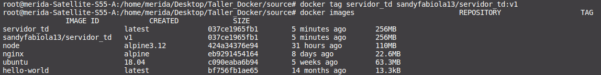

# :whale: Creación de imagenes con Docker
Es momento de que crear nuestra propia imágen con Docker a partir de otra, personalicemos. También vamos a aprender a subirla al repositorio público de contenedores [Docher Hub](https://hub.docker.com/).

:bangbang: Te recomiendo que pases primero por el taller 2

:bangbang: Ten en cuenta que tomo sistema operativo host un Ubuntu 18.04LTS. Puedes tenerlo instalado en tu ordenador o en algun servicio de la nube.


## :heavy_check_mark: (Opcional) Ejecución local del servidor
La ejecución local del servidor es opcional, solo es para ejemplificar más ampliamente.

Como ves en este repositorio está una carpeta llamada *source* en la cual se encuentra el código de un servidor básico genereado con Express/Node.js; puedes correr ese servidor de manera local para ello tiene que tener instalado npm y node, entonces posisionate en el directorio *Taller_Docker/source* ejecuta en consola:
```
$ npm i
$ node dist/index.js
```
luego entra a tu navegador a la URL:
````
http://localhost:3000/
````
Y veras que retorna la siguiente pantalla, que significa que el servidor esta corriendo localmente en el puerto 3000 del ordenador host y nos da la hora del mismo:


:o: Ten en cuenta que para ejecutar los comando que se escriban de acá en adelante deben ejecutarse como root.

## :heavy_check_mark: Crear el archivo Dockerfile 
Regresemos al tema principal y nuestra finalidad será que generaremos una imagen que contenga el servidor antes descrito y lo subiremos a [Docker Hub](https://hub.docker.com/) para que todos tengan acceso a el y lo puedan tratar como una imagen como las que hemos estado trabajando, sin la necesidad de volver a instalar el servidor y solo utilizarlo.

:wrench: Debes de crear el archivo Dockerfile, sí asi sin extensión ni más, esto lo harás en la carpeta de *Taller_Docker/source* y agragas lo siguiente y lo guardas:
(este documento ya está tambien en este repositorio)
```
FROM node:alpine3.12

WORKDIR /usr/src/app

COPY . .

RUN npm install

CMD [ "node","dist/index.js"]

```


### :eyeglasses: Explicación
- FROM indica que la imagen base es node:alpine3.12, que significa que esta basada en node en la versión alipen 3.12.

- WORKDIR es el directorio en el cual se trabajará dentro del conteiner en donde copiaremos el contenido de la carpeta *source*

- COPY Copia todo los archivos que estan al nivel del Dockerfile en el WORKDIR

- RUN Ejecuta el comando npm install que instala los módulos de node.

- CMD corre en comando node dist/index.js 

## :heavy_check_mark: Login en DockerHub
Antes de los siguientes pasos debe de tener un usuario en [Docker Hub](https://hub.docker.com/) y ten presente tu User y Password

En consola y con permisos de super usuario:
```
$ docker login -u <USER>
```
te pedirá tu contraseña y la ingresas y das enter, te saldrá una pantalla parecida a esta:


## :heavy_check_mark: Construcción de la imagen 

:wrench: Desde la terminal nos sitamos en la el directorio donde se encuentra el **Dockerfile**, en este caso *Taller_Docker/source* y creamos nuesta imagen con el comando **docker build**
```
$ docker build -t <NAME> .
```
donde NAME en este caso será *servidor_td*, todo debe ir en minúsculas de preferencia.

Tendrías que tener algo como esto, nota que en la lista de imagenes no aparece aun nuestra imagen


En consola saldrá el siguiente log:


Listemos las imágenes de docker que tenemos descargadas y veremos que existe la que acabamos de contruir:


:wrench: Para subir una imagen debemos de hacer uso de tags como veremos. 
Podemos versionar nuestras imágenes por medio de el uso de tags:

```
$ docker tag <ID_IMAGE> <USER>/<NAME>[:v#]
```
de lo anterior podemos decir que <ID_IMAGE> es el identificador de la imágen, puede ser el nombre o el id, <USER> es el usuario que generaste al registrarte en [Docker Hub](https://hub.docker.com/), <NAME> es el mombre que se le dará a la imágen en el repositorio y con el cual se descargará y el [v#] es opcional e indicaría la versión de la imagen.

Hagamos el propio con la versón 1 para nuestra imágen *servidor_td*:
```
$ docker tag servidor_td <USER>/servidor_td:v1
```


como vemos tenemos la imagen original y la versionada que acabamos de crear, esta versionada es la que subiremos al [Docker Hub](https://hub.docker.com/).

Para subir la imagen usamos *docker push*
```
$ docker push <USER>/servidor_td:v1
```


## :heavy_check_mark: Creación de contenedor y mapeo
Puede que tu usuario sea privado y vas a necesitar logearte antes para desgargar la imagen

Ahora creemos y pongamos a correr nuestro primer contenedor basados en la imágen que acabamos de construir, nuestro contenedor se llamará servidor1:
```
$ docker run -it -d -p 8000:3000 --name=servidor1 <USER>/servidor_td:v1
```
### :eyeglasses: Explicación
- -it permite tener una consola interactiva
- -d nos dice que se ejecuta en segundo plano

- -p mapeo de puertos, en el host es el 8000 y el del contenedor es el 3000
- --name nombre que le damos al contenedor

En consola vermos por medio del comando *docker ps -a* que nuestro contenedor esta activo:


Ahora entremos a nuestro navegador a la URL:
```
http://localhost:8000
```


Note que ahora es el puerto 8000 por el mapeo de puertos. Que quede claro que para el contenedor si sigue siendo el puerto 3000.

## :heavy_check_mark: Borrando imágenes
:bangbang: Antes de borrar una imagen tienes que tener en cuenta que no la usa ninguno de los containers que has creado o aparece en listado cuando ejecutas *docker ps -a*.

Para borrar las imágenes descargadas o en dado caso te confundas al colocar el tag usa el comando *docker rmi*.

:wrench: Si tu image esta es diferente a la versión latest, usa el tag. Por ejemplo:
```
$ docker rmi <USER>/servidor_td:v1
```
ve como ya no aparece la segunda vez la image <USER>/servidor_td:v1


:wrench: Si tu image tiene versión latest no es necesario que agregues un tag:
```
$ docker rmi servidor_td
```
ve como ya no aparece en el listado de images


